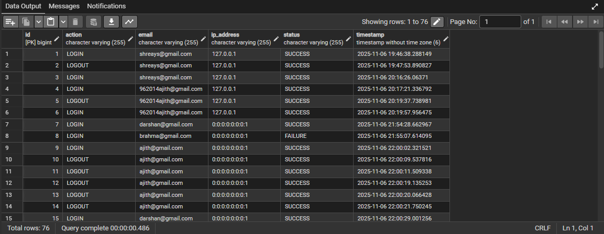
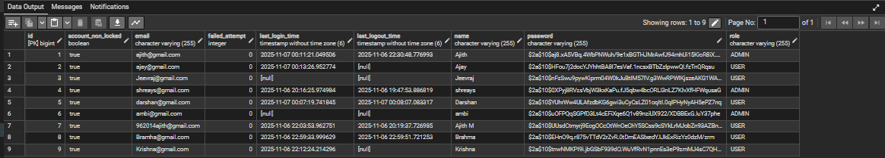

**Secured Login Application**
 
This project is a Spring Boot backend service that provides secure user authentication, JWT-based authorization, and role-based access control.
It also includes account locking, audit logging, and admin management features.
 
**Features**
 
1. User registration and login using JWT authentication  
2. Password encryption with BCrypt  
3. Role-based access control (USER / ADMIN)  
4. Account lock after 3 consecutive failed login attempts  
5. Audit logging for login and logout actions  
6. Admin endpoints to manage users and unlock accounts
 
**Tech Stack**
| Technology                | Description                      |
| ------------------------- | -------------------------------- |
| **Java 17+**              | Programming language             |
| **Spring Boot 3+**        | Framework for building REST APIs |
| **Spring Security**       | Authentication and authorization |
| **Spring Data JPA**       | ORM layer for database access    |
| **PostgreSQL**            | Relational database              |
| **Maven**                 | Build and dependency management  |
| **JWT (io.jsonwebtoken)** | JSON Web Token authentication    |
 
**API Endpoints**
 
| Method | Endpoint             | Description                  |
| ------ | -------------------- | ---------------------------- |
| `POST` | `/api/auth/register` | Register a new user          |
| `POST` | `/api/auth/login`    | Login and generate JWT token |
 
 
**User**
 
| Method | Endpoint          | Description                            |
| ------ | ----------------- | -------------------------------------- |
| `GET`  | `/api/user/info`  | Get user profile and audit info        |
| `GET`  | `/api/user/audit` | Get user’s own login/logout audit logs |
 
**Admin**
 
| Method | Endpoint                         | Description                               |
| ------ | -------------------------------- | ----------------------------------------- |
| `GET`  | `/api/admin/users`               | List all registered users                 |
| `GET`  | `/api/admin/users/{id}/attempts` | Get failed login attempt count for a user |
| `POST` | `/api/admin/users/{id}/promote`  | Promote a user to ADMIN                   |
| `POST` | `/api/admin/users/{id}/unlock`   | Unlock a locked user account              |
 

 
